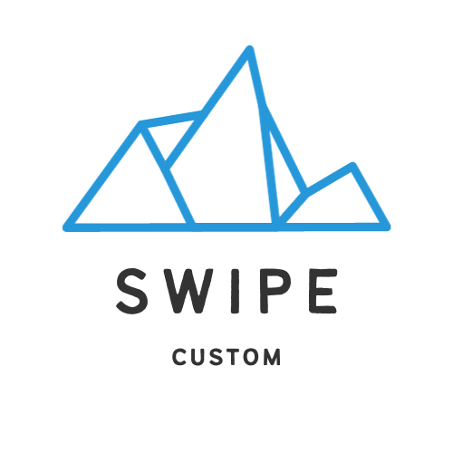

<p align="center">
  
</p>

<h1 align="center">Custom-Swipe</h1>

<p align="center">
  <strong>A Lightweight, Headless, and Responsive Multi-Framework Swipe Library</strong>
</p>

<p align="center">
  <a href="https://www.npmjs.com/package/react-custom-swipe"></a>
  <a href="https://www.npmjs.com/package/vue-custom-swipe"></a>
  <a href="https://www.npmjs.com/package/svelte-custom-swipe"></a>
  <a href="https://www.npmjs.com/package/custom-swipe"></a>
  <a href="https://github.com/yoonjonglyu/custom-swipe/blob/main/LICENSE"></a>
</p>

---

## Overview

**Custom-Swipe** provides smooth, hardware-accelerated touch and mouse swipe interactions across web applications without heavy third-party dependencies.

Powered by a shared TypeScript core engine (`swipe-core-provider`), it delivers consistent swipe physics, flick gesture detection, responsive recalculation, and browser URL history synchronization across **React**, **Vue**, **Svelte**, and **Web Components**.

### 🌟 Key Highlights

- 🪶 **Ultra-Lightweight**: Minimal bundle footprint, zero heavy slider dependencies.
- 🧩 **Headless & Declarative**: Use as a headless hook/composable for total UI freedom, or drop in ready-to-use `<Swipe />` components.
- 🔗 **Browser History & URL Sync**: Synchronize slide position with URL query strings (`?index=2`) and browser back/forward buttons using the HTML5 History API.
- ⚡ **SSR Safe**: First-class support for Next.js, Nuxt, and SvelteKit server-side rendering.
- 📱 **Hybrid Input Handling**: Robust gesture recognition supporting touch, mouse, stylus, and desktop mobile emulation.
- 📐 **Directional Support**: Smooth swipe in both horizontal (`row`) and vertical (`column`) directions.

🎮 **[Live Demo](https://yoonjonglyu.github.io/custom-swipe/)**

---

## Packages

| Package | Framework | Installation | Description |
|---|---|---|---|
| [`react-custom-swipe`](./packages/react-custom-swipe) | **React 18+** | `npm i react-custom-swipe` | Hook (`useSwipe`) & `<Swipe />`, `<Carousel />` |
| [`vue-custom-swipe`](./packages/vue-custom-swipe) | **Vue 3+** | `npm i vue-custom-swipe` | Composable (`useSwipe`) & `<Swipe />` |
| [`svelte-custom-swipe`](./packages/svelte-custom-swipe) | **Svelte 4+** | `npm i svelte-custom-swipe` | Hook (`useSwipe`) & `<Swipe />` |
| [`custom-swipe`](./packages/custom-swipe) | **Web Components / Vanilla** | `npm i custom-swipe` | `<custom-swipe>` Custom Element & `useSwipe` |
| [`swipe-core-provider`](./packages/core) | **Core Engine** | `npm i swipe-core-provider` | Gesture math, state machine & history sync |

---

## Quick Start

### 1. React (`react-custom-swipe`)

```bash
npm install react-custom-swipe
# or
yarn add react-custom-swipe
```

#### Declarative Component
```tsx
import React from 'react';
import ReactSwipe from 'react-custom-swipe';

export default function App() {
  const items = [
    <div key="1">Slide 1</div>,
    <div key="2">Slide 2</div>,
    <div key="3">Slide 3</div>,
  ];

  return (
    <ReactSwipe
      item={items}
      config={{
        direction: 'row',
        isCarousel: true,
        isHistory: true, // Syncs with ?index=N
        paramName: 'index',
      }}
    />
  );
}
```

#### Headless Hook
```tsx
import React, { useRef } from 'react';
import { useSwipe } from 'react-custom-swipe';

export default function CustomSlider({ items }) {
  const ref = useRef<HTMLUListElement>(null);
  const { swipeEvents, handleSlide, changeIndex } = useSwipe(ref, items.length);

  return (
    <div className="slider-container">
      <button onClick={() => handleSlide('L')}>Prev</button>
      <button onClick={() => handleSlide('R')}>Next</button>
      <ul ref={ref} {...swipeEvents}>
        {items.map((item, idx) => (
          <li key={idx}>{item}</li>
        ))}
      </ul>
    </div>
  );
}
```

---

### 2. Vue 3 (`vue-custom-swipe`)

```bash
npm install vue-custom-swipe
# or
yarn add vue-custom-swipe
```

```vue
<script setup>
import { Swipe } from 'vue-custom-swipe';
import 'vue-custom-swipe/dist/index.css';

const config = {
  direction: 'row',
  isCarousel: true,
  isHistory: true,
};
</script>

<template>
  <Swipe :config="config">
    <li class="swipe-item">Slide 1</li>
    <li class="swipe-item">Slide 2</li>
    <li class="swipe-item">Slide 3</li>
  </Swipe>
</template>
```

---

### 3. Svelte (`svelte-custom-swipe`)

```bash
npm install svelte-custom-swipe
# or
yarn add svelte-custom-swipe
```

```svelte
<script>
  import Swipe from 'svelte-custom-swipe';

  const items = ['Slide 1', 'Slide 2', 'Slide 3'];
  const config = { isCarousel: true, direction: 'row' };
</script>

<Swipe item={items} {config}>
  <svelte:fragment slot="swipeitem" let:swipe>
    <div>{swipe}</div>
  </svelte:fragment>
</Swipe>
```

---

### 4. Web Components (`custom-swipe`)

```bash
npm install custom-swipe
# or
yarn add custom-swipe
```

```html
<script type="module">
  import { defineSwipe } from 'custom-swipe';
  defineSwipe();
</script>

<custom-swipe direction="row" ishistory="true" paramname="index">
  <div>Slide 1</div>
  <div>Slide 2</div>
  <div>Slide 3</div>
</custom-swipe>
```

---

## Configuration API (`ConfigProps`)

All packages share the same configuration interface provided by `swipe-core-provider`:

| Option | Type | Default | Description |
|---|---|---|---|
| `direction` | `'row' \| 'column'` | `'row'` | Swipe axis (`row` for horizontal, `column` for vertical). |
| `isHistory` | `boolean` | `false` | Enables HTML5 History API integration with URL query parameters and browser back/forward buttons. |
| `paramName` | `string` | `'index'` | The query parameter key used for tracking slide position (e.g. `?index=1`). |
| `isCarousel` | `boolean` | `false` | Enables built-in previous/next buttons and pagination dot indicators. |
| `historyCallback` | `(state: SwipeStateProps) => void` | `undefined` | Callback fired whenever the slide transition completes and the index changes. |

### `SwipeStateProps`
```typescript
interface SwipeStateProps {
  isSwipe: 'pending' | 'wait' | 'disable';
  startX: number;
  startY: number;
  currentX: number;
  currentY: number;
  currentStep: number; // Current slide index (0 to length - 1)
  swipeTime: number;
  direction: 'row' | 'column';
}
```

---

## Monorepo Development

This project uses Yarn Workspaces and Lerna.

```bash
# Install dependencies
yarn install

# Build all packages
yarn build:all

# Build individual packages
yarn build:core    # packages/core
yarn build:react   # packages/react-custom-swipe
yarn build:vue     # packages/vue-custom-swipe
yarn build:svelte  # packages/svelte-custom-swipe
yarn build:custom  # packages/custom-swipe

# Run demo app
yarn workspace react-custom-swipe-demo dev
```

---

## License

[MIT](LICENSE) © [Isa (YoonJong Ryu)](https://github.com/yoonjonglyu)
