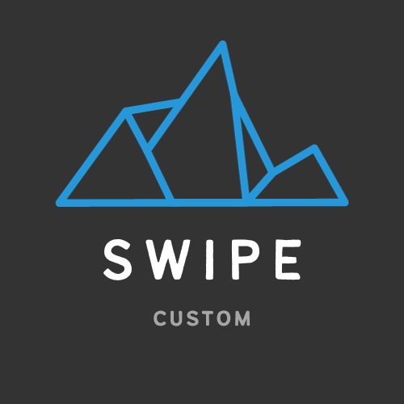

    

# Custom-Swipe: A Lightweight and Headless Frontend Library

Custom-Swipe is a versatile solution designed for seamless user interactions in web applications. Whether you're building a responsive web app or enhancing the user experience on various devices, Custom-Swipe offers a range of swipe features. It serves as both a basic component for easy integration and a powerful headless hook for developers seeking granular control.

## Key Features

- **Lightweight:** Minimize your bundle size with our lightweight library.
- **Responsive:** Ensure smooth interactions across various devices and screen sizes.
- **Customizable:** Tailor swipe behavior to suit your application's specific needs.
- **Headless Hook:** For developers who prefer a programmatic approach, our headless hook provides extensive control over swipe events.

Explore the possibilities with Custom-Swipe and elevate your frontend development experience.

[demo](https://yoonjonglyu.github.io/custom-swipe/)

## Supports

1. [custom-swipe.](https://github.com/yoonjonglyu/custom-swipe/tree/main/packages/custom-swipe)
2. [react-custom-swipe.](https://github.com/yoonjonglyu/custom-swipe/tree/main/packages/react-custom-swipe)
3. [vue-custom-swipe.](https://github.com/yoonjonglyu/custom-swipe/tree/main/packages/vue-custom-swipe)
4. [svelte-custom-swipe.](https://github.com/yoonjonglyu/custom-swipe/tree/main/packages/svelte-custom-swipe)

## Features

1. Swipe
2. Infinite swipe(scroll)
3. Carousel

## LICENSE

- MIT
  See [LICENSE](LICENSE) for details.
